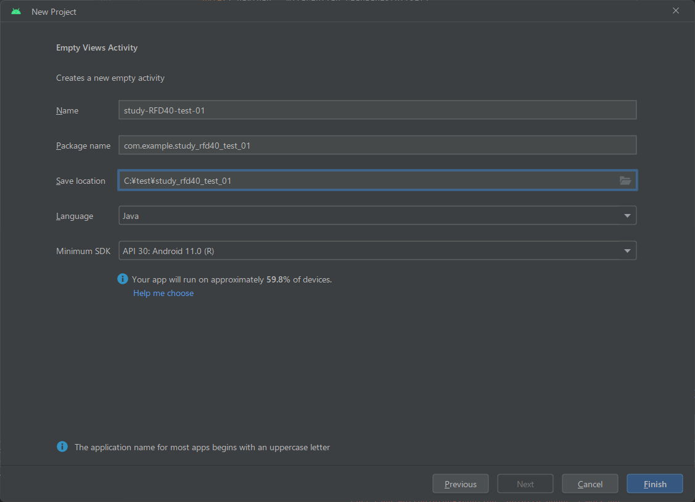
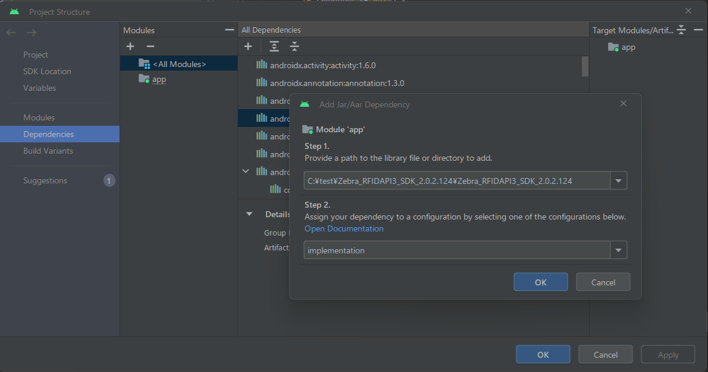

## RFD40リーダー向け開発手解き書（Zebra Android 端末編）

2024/03/30 Updated

-----

### ■ はじめに 

本書は、RFD40 向けAndroid アプリケーション開発者向け手解き書となります。開発に必要なソフトウェアの入手方法、セットアップ手順、及び SDKのサンプルプログラムについて解説します。 

Android 向けの印刷プログラムには Java/Kolin 等の開発言語が利用可能であり、それぞれの開発言語でゼブラプリンタ向けのアプリケーションを作成可能ですが、本書におきましては Java 言語で開発することを前提に作成されています。Java 以外の開発言語をご利用の際は関連のドキュメントや情報源を参照ください。

尚、本ガイドにはRFD本体の設定方法やAndroid Studio自体の環境構築の記載については紙面の関係上割愛しています。RFD40本体の設定方法やAndroid Studioの基本的な操作・セットアップについては関連ドキュメントをご参照願います。
    </br>
    </br>

-----

### ■ 開発にあたって必要なマテリアル

 1. ハードウェア
    - Android Studioを実行可能なPC*1
    - Zebra RFD40 *1
    - Zebra Android 端末 *1 
    - USB Type-C ケーブル *2
    </br>

 2. ソフトウェア
    - Android Studio *1
    - ZEBRA RFID READER SDK FOR ANDROID *1
    </br>
    <br>
    

    <font size=1>
    *1 本書では下記環境を前提に解説いたします。

    - Windows 11 PC
    - RFD40 firmware : SAAFKS00-006-R01
    - EC5x : Android 11
    - Android Studio Flamingo
    - ZEBRA RFID READER SDK FOR ANDROID Ver.2.0.2.124

    *2 PCとAndroid端末/RFD40 接続用となります。
    </font>

    </br>
    </br>


-----

### ■ 一般的な開発フロー

一般的な開発フローは下記の通りです。

1. 準備
    開発にあたって、必要なマテリアルが全てそろっているかご確認ください。また、RFDリーダーのファームウェア、 Android OS、Android Studio 等のバージョンが目的に沿ったものであることもご確認ください。
    </br>

1. SDK のダウンロード
   最新のSDKをwww.zebra.comからダウンロードし、任意のフォルダで解凍します。
   </br>

1. Android Studio の環境構築
   Android Studio の基本的な設定を済ませた後に、SDKとの依存関係を構築します。
   </br>

1. 開発コーディング
   開発向けコーディングをします。
</br></br>

-----

### ■ SDKのダウンロード

1. zebra.com からRFD40用のSDKをダウンロードください。

    **ZEBRA RFID READER SDK FOR ANDROID**

    https://www.zebra.com/us/en/support-downloads/software/developer-tools/rfid-sdk-for-android.html

   ※ INSTALLATION REQUIREMENTS を一読し、開発環境が適切であるか確認することを推奨いたします。
   </br>

1. SDKのzip を任意のフォルダにて解凍ください。

</br>
</br>

-----


### ■ プロジェクトの作成とSDKのインポート


1. Android Studio(以下AS)を起動し、新規プロジェクトを作成します。
   
   

</br>


1. [File] > [Project Structure] > [Dependencies] に移動します。
</br>

2. [Declared Dependencies] タブで  [+]をクリックし、メニューで [Jar Dependency] を選択します。
</br>

1. 下記aarファイルが含まれるフォルダを選択し、[Apply]を選択します。

    

    

    </br>
    </br>
    
    参考リンク: AAR または JAR を依存関係として追加する

    https://developer.android.com/studio/projects/android-library?hl=ja#psd-add-aar-jar-dependency

    </br>

2. 指定した依存関係がbuild.gradle に登録されていることを確認する。

    ```java
    dependencies {implementation fileTree(dir: 'C:\\test\\Zebra_RFIDAPI3_SDK_2.0.2.124\\Zebra_RFIDAPI3_SDK_2.0.2.124', include: ['*.aar', '*.jar'], exclude: [])
    }
    ```

    </br>

3. MainActivity.java でAPI がインポートできることを確認する。

    ```java
    import com.zebra.rfid.api3.*;
    ```

</br>

**[ 備考 ]**
RFID SDK For Android 2.0.2.94 以前をご利用の場合は下記リンクを参考にご設定ください。
https://techdocs.zebra.com/dcs/rfid/android/2-0-2-94/tutorials/tutcreateprojectandroidstudio/
</br>
</br>

-----

### ■ 開発・コーディング

公開されているサンプルコードやAPIリファレンスなどを参考にコーディングをします。下記はリーダーに接続するサンプルコードとなります。

```java
package com.example.study_rfd40_test_01;

import android.os.Bundle;
import android.util.Log;

import androidx.appcompat.app.AppCompatActivity;

import com.zebra.rfid.api3.ENUM_TRANSPORT;
import com.zebra.rfid.api3.InvalidUsageException;
import com.zebra.rfid.api3.OperationFailureException;
import com.zebra.rfid.api3.RFIDReader;
import com.zebra.rfid.api3.ReaderDevice;
import com.zebra.rfid.api3.Readers;
import java.util.ArrayList;


public class MainActivity extends AppCompatActivity {

    private static Readers readers;
    private static ArrayList availableRFIDReaderList;
    private static ReaderDevice readerDevice;
    private static RFIDReader reader;
    private static String TAG = "DEMO";


    @Override
    protected void onCreate(Bundle savedInstanceState) {
        super.onCreate(savedInstanceState);
        setContentView(R.layout.activity_main);

        if (readers == null) {
            readers = new Readers(this, ENUM_TRANSPORT.ALL);
        }

        try {
            if (readers != null) {
                if (readers.GetAvailableRFIDReaderList() != null) {
                    availableRFIDReaderList = readers.GetAvailableRFIDReaderList();
                    if (availableRFIDReaderList.size() != 0) {
                        // get first reader from list
                        readerDevice = (ReaderDevice) availableRFIDReaderList.get(0);
                        reader = readerDevice.getRFIDReader();
                        if (!reader.isConnected()) {
                            // Establish connection to the RFID Reader
                            reader.connect();
                        }
                    }
                }
            }
        } catch (InvalidUsageException e) {
            e.printStackTrace();
        } catch (OperationFailureException e) {
            e.printStackTrace();
            Log.d(TAG, "OperationFailureException " + e.getVendorMessage());
        }
    }
}
```

</br>
</br>

-----

### ■ リファレンス

</br>

> Introduction to API3 sdk

  SDK/LIBのアーキテクチャと構造について解説</br>
https://techdocs.zebra.com/dcs/rfid/android/2-0-2-124/guide/introduction-to-api3-sdk/
</br>

> Package com.zebra.rfid.api3

各APIのリファレンス</br>
https://techdocs.zebra.com/dcs/rfid/android/2-0-2-124/apis/com/zebra/rfid/api3/package-summary
</br>

> About RFID SDK For Android

SDKのテクニカルドキュメントがまとめられたサイト。サンプルコードやGetting Started 等の情報が参照可能。</br>
https://techdocs.zebra.com/dcs/rfid/android/2-0-2-124/guide/about/
<br>

> RFD40 UHF RFID リーダーサポート

RFD40のユーザーズガイドやファームウェアのダウンロードが可能。</br>
https://www.zebra.com/jp/ja/support-downloads/rfid/rfid-handhelds/rfd40.html

